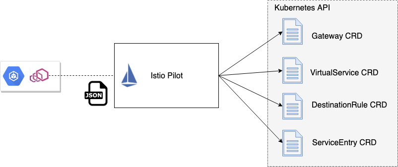

[编者按]

> 本文演示了如何基于Go语言、gRPC和Protobuf技术构建一个微服务，并着重介绍了实现Istio可观测功能的三大支柱：日志、度量和追踪，以及与之对应的工具Logrus、Prometheus、Grafana、Jeager等。通过文章内容和示例代码，读者会对如何构建gRPC技术栈的微服务和使用Istio可视化工具观测服务的实现方案有一个全面的认识。

这是探索为Envoy构建控制平面[系列文章](https://blog.christianposta.com/envoy/guidance-for-building-a-control-plane-to-manage-envoy-proxy-based-infrastructure/) 的第3部分。

在这个系列博客中，我们研究了下面的领域：

- [采用一种机制来动态更新Envoy的路由、服务发现和其他配置](https://blog.christianposta.com/envoy/guidance-for-building-a-control-plane-to-manage-envoy-proxy-based-infrastructure/)
- [识别构成控制平面的组件，包括后端存储、服务发现API和安全控件等](https://blog.christianposta.com/envoy/guidance-for-building-a-control-plane-for-envoy-identify-components/)
- 构建最适合你的用例和组织的特定域的配置对象和API（本文）
- [考虑如何最好地使你的控制平面可插入在你需要的地方](https://blog.christianposta.com/guidance-for-building-a-control-plane-for-envoy-build-for-pluggability/)
- [部署各种控制平面组件的选项](https://blog.christianposta.com/guidance-for-building-a-control-plane-for-envoy-deployment-tradeoffs/)
- 为你的控制平面思考一个测试套件

在[前一篇](https://blog.christianposta.com/envoy/guidance-for-building-a-control-plane-for-envoy-identify-components/) ，我们评估了控制平面可能需要的组件。在本节中，我们将探索特定于域的API在你的控制平面上可能是什么样子的。

## 构建你的控制平面和API层面的交互点

一旦你考虑了哪些组件可能构成你的控制平面架构（请参阅前面的部分），你会想要确切地考虑用户将如何与控制平面交互，甚至更重要的是，*你的用户是谁？*要回答这个问题，您必须决定基于Envoy的基础架构将扮演什么角色，以及流量将如何通过你的架构。它可以是下面的组合：

- API 管理网关（北/南）
- 简单的Kubernetes边界负载均衡 / 反向代理 / 入口控制 （北/南）
- 共享的服务代理（东/西）
- 每个服务的Sidecar （东/西）

例如，Istio项目旨在成为服务网格平台，操作员可以在此基础上构建工具来驱动服务和应用程序之间的网络控制。Istio中用于配置Envoy的特定域的配置对象有以下几种：

- [Gateway](https://istio.io/docs/reference/config/istio.networking.v1alpha3/#Gateway) – 定义一个共享的代理控件（集群入口能力），指定可用于负载平衡和路由流量的协议、TLS、端口和主机/权限。
- [VirtualService](https://istio.io/docs/reference/config/istio.networking.v1alpha3/#VirtualService) – 如何与特定服务交互的规则；可以指定诸如路由匹配行为、超时、重试等。
- [DestinationRule](https://istio.io/docs/reference/config/istio.networking.v1alpha3/#DestinationRule) – 如何与特定服务进行交互的规则，包括断路、负载平衡、mTLS策略、服务的子集定义等。
- [ServiceEntry](https://istio.io/docs/reference/config/istio.networking.v1alpha3/#ServiceEntry) – 显式地将服务添加到Istio的服务注册表。

在Kubernetes中运行，所有那些配置对象被实现为[CustomResourceDefinitions](https://kubernetes.io/docs/concepts/extend-kubernetes/api-extension/custom-resources/)。

[Heptio/VMWare Contour](https://github.com/heptio/contour) 旨在作为Kubernetes的入口网关，并具有简化的特定域的配置模型，同时具有CustomResourceDefinition (CRD)和 [Kubernetes Ingress resource](https://kubernetes.io/docs/concepts/services-networking/ingress/)。

- [IngressRoute](https://github.com/heptio/contour/blob/master/docs/ingressroute.md) 是一个Kubernetes CRD，提供一个单一位置来指定Contour代理的配置。 
- [Ingress Resource support](https://github.com/heptio/contour/blob/master/docs/annotations.md) 允许你在Kubernetes Ingress资源上指定注解，如果你愿意这么做。

On the [Gloo project](https://gloo.solo.io/) we’ve made the decision to split the available configuration objects into two levels:

- The user-facing configurations for best ergonomics of *user* use cases and leave options for extensibility (more on that in next section)
- The lower-level configuration that abstracts Envoy but is not expressly intended for direct user manipulation. The higher-level objects get transformed to this lower-level representation which is ultimately what’s used to translate to Envoy xDS APIs. The reasons for this will be clear in the next section.

For users, Gloo focuses on teams owning their routing configurations since the semantics of the routing (and the available transformations/aggregation capabilities) are heavily influenced by the developers of APIs and microservices. For the user-facing API objects, we use:

- [Gateway](https://gloo.solo.io/v1/github.com/solo-io/gloo/projects/gateway/api/v1/gateway.proto.sk/) – specify the routes and API endpoints available at a specific listener port as well as what security accompanies each API
- [VirtualService](https://gloo.solo.io/v1/github.com/solo-io/gloo/projects/gateway/api/v1/virtual_service.proto.sk/) – groups API routes into a set of “virtual APIs” that can route to backed functions (gRPC, http/1, http/2, lambda, etc); gives the developer control over how a route proceeds with [different transformations](https://gloo.solo.io/v1/github.com/solo-io/gloo/projects/gloo/api/v1/plugins/transformation/transformation.proto.sk/) in an attempt to decouple the front end API from what exists in the backend (and any breaking changes a backend might introduce)

Note these are different than the Istio variants of these objects.

The user-facing API objects in Gloo drive the lower-level objects which are then used to ultimately derive the Envoy xDS configurations. For example, Gloo’s lower-level, core API objects are:

- [Upstream](https://gloo.solo.io/v1/github.com/solo-io/gloo/projects/gloo/api/v1/upstream.proto.sk/) – captures the details about backend clusters and the functions that are exposed on this. You can loosely associate a Gloo Upstream with an [Envoy cluster](https://www.envoyproxy.io/docs/envoy/latest/api-v2/api/v2/cds.proto) with one big difference: An upstream can understand the actual service functions available at a specific endpoint (in other words, knows about `/foo/bar` and `/bar/wine` including their expected parameters and parameter structure rather than just `hostname:port`). More on that in a second.
- [Proxy](https://gloo.solo.io/v1/github.com/solo-io/gloo/projects/gloo/api/v1/proxy.proto.sk/) – The proxy is the main object that abstracts all of the configuration we can apply to Envoy. This includes listeners, virtual hosts, routes, and upstreams. The higher-level objects (VirtualService, Gateway, etc) are used to drive this lower-level Proxy object.

The split between the two levels of configuration for the Gloo control allows us to extend the Gloo control-plane capabilities while keeping a simple abstraction to configure Envoy. This is explained in more detail in part 4 of this series.

In the previous three examples (Istio, Contour, Gloo) each respective control plane exposes a set of domain-specific configuration objects that are user focused but are ultimately transformed into Envoy configuration and exposed over the xDS data plane API. This provides a decoupling between Envoy and a user’s predisposed way of working and their workflows. Although we’ve seen a few examples of creating a more user and workflow focused domain-specific configuration for abstracting Envoy, that’s not the only way to build up an Envoy control plane. [Booking.com has a great presentation](https://www.slideshare.net/IvanKruglov/ivan-kruglov-introducing-envoybased-service-mesh-at-bookingcom-version-7) on how they stayed much closer to the Envoy configurations and used an engine to just merge all the different teams’ configuration fragments into the actual Envoy configuration.

Alongside considering a domain-specific configuration, you should consider the specific touch points of your API/object model. For example, Kubernetes is very YAML and resource-file focused. You could build a more domain-specific CLI tool (like [OpenShift did with the oc CLI](https://docs.openshift.com/enterprise/3.2/dev_guide/new_app.html#dev-guide-new-app), like Istio [did with istioctl](https://istio.io/docs/reference/commands/istioctl/) and like Gloo [did with glooctl](https://gloo.solo.io/cli/glooctl/)

### Takeaway

When you build an Envoy control plane, you’re doing so with a specific intent or set of architectures/users in mind. You should take this into account and build the right ergonomic, opinionated domain-specific API that suits your users and improves your workflow for operating Envoy. [The Gloo team](https://github.com/solo-io/gloo/graphs/contributors) recommends exploring *existing* Envoy control plane implementations and only building your own if none of the others are suitable. Gloo’s control plane lays the foundation to be extended and customized. As we’ll see in the next entry, it’s possible to build a control plane that is fully extendable to fit many different users, workflows, and operational constraints.